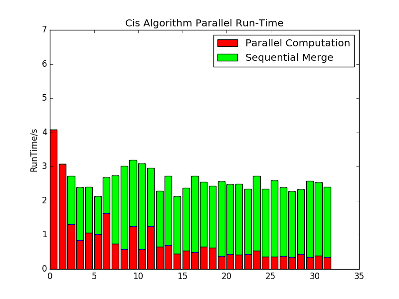
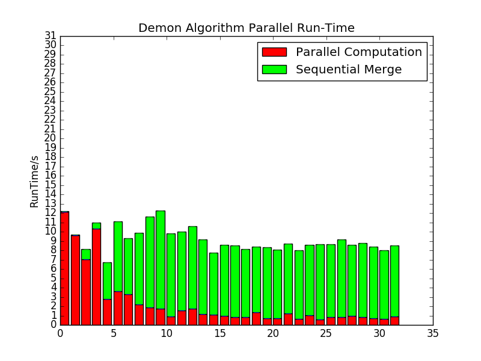

#Attention Please
- Pthread_Create, void * have to make the input arguments existing until they are joined  
- Pay attention to dead lock  

#Potential Improvement Points
- For CIS algorithm, the merge operation takes a lot of time for the dataset of collaboration, which is sequential,sequential 4s, parallel 2.4s    
- For Demon algorithm, not exist such problem, and the execution time is very long, 13s for parallel and 24s for sequential,  
the merge operation do not take a lot of time

#Experiment
- CisExp
  
- DemonExp
  
